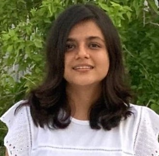

<!--  -->

{: .img-left}

I am a senior undergraduate in the department of Electrical Engineering and pursuing minor in Computer Science at Indian Institute of Technology, Gandhinagar. I am passionate about using machine Learning, deep learning and algorithms in various fields for making human life more sustainable. I have worked on applying machine learning and algorithms for applications in healthcare and energy sector.

 
