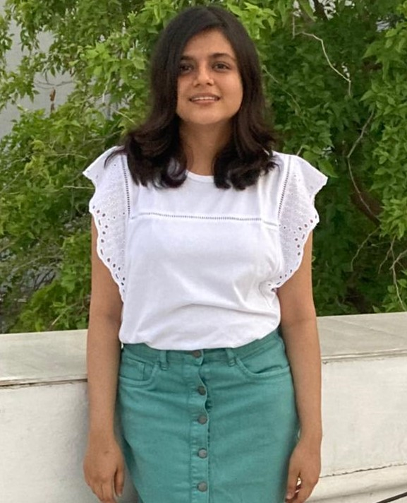

<!--  -->

{: .img-left}

I am senior undergraduate in department of Electrical Engineering and pursuing minor in Computer Science at Indian Institute of Technology, Gandhinagar. I am passionate about the use of Machine Learning, Deep learning and algorithms in various fields for making human life more sustainable. I have worked on implementation of various machine learning models for energy disaggreation task, and I have even worked in the domain of biomedical engineering for detection of tissue stiffness through cross-correlation algorithm. 

Recently, my work **Neural network approaches and dataset parser for NILM toolkit** got accepted in Buildsys 2021. 
